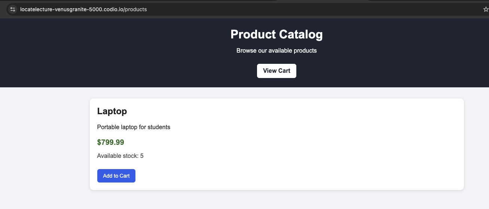
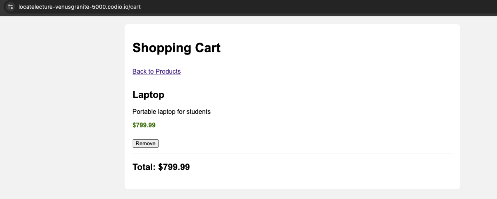
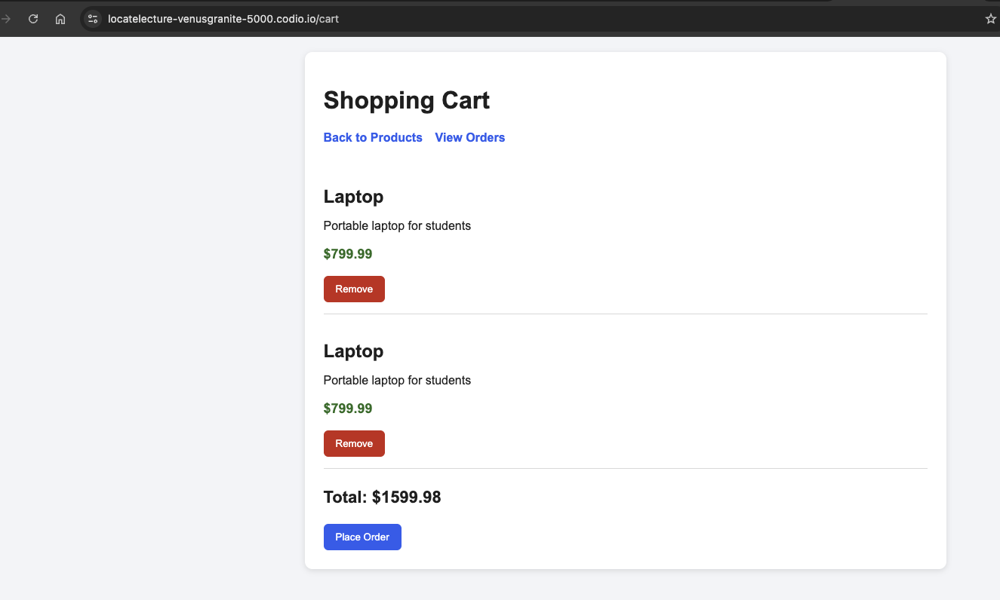
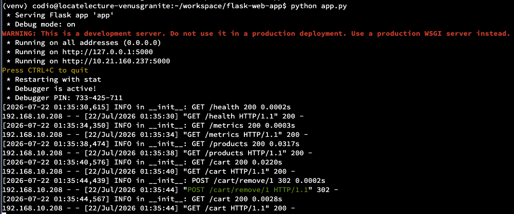
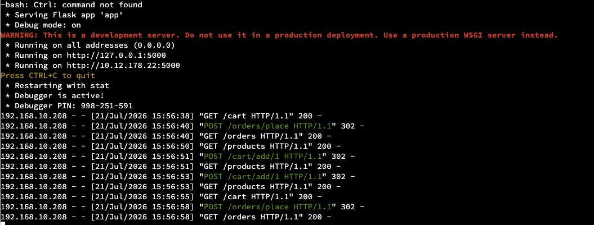
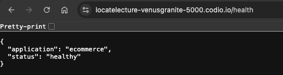
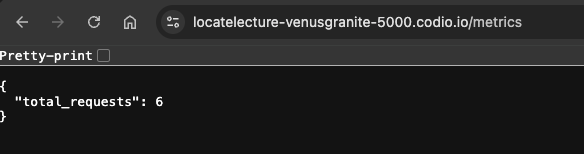

# Final Project Presentation - Ecommerce Flask Application

## Slide 1: Problem

**Problem:** We have a customer who wants to list products, manage shopping carts, accept product orders, and monitor application health using modern web technologies.

## Slide 2: Features

The application is built using Flask. It includes the following features:

- User authentication
- Product catalog
- Shopping cart
- Order management
- Health monitoring
- Request metrics

## Slide 3: Challenges

A few challenges experienced during the course:

- Codio does not support running Docker directly
- GitHub requires a Personal Access Token for authentication
- The application required a separate MySQL application user

## Slide 4: Application Screenshots

### Product Catalog

### Shopping Cart

### Shopping Cart with Multiple Products

### Application Running in Codio

### Order and Cart Requests

### Health Endpoint

### Metrics Endpoint

## Slide 5: Thank You

Thank you, Professor, for your guidance and support throughout this course. I truly appreciate the practical knowledge and hands-on experience I gained while building this project.
